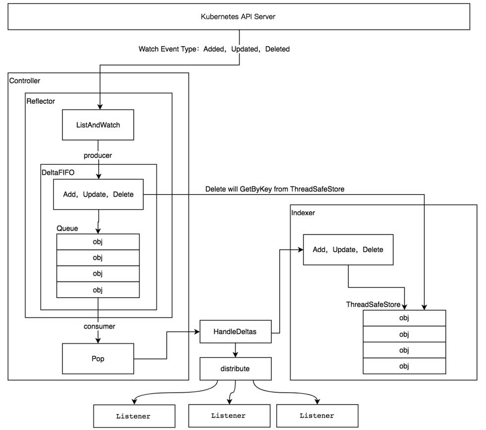
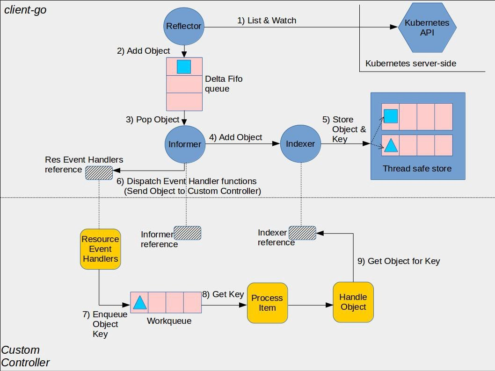

# 简介
informer是client-go中一个比较重要也是比较核心的组件，其整体结构如下：

## 几个核心的对象介绍
这些是informer运行中的一些必不可少的组件，后面针对每个组件进行源码分析
### Controller
从源码来看Controller是鼻祖，他也是SharedInformer和SharedIndexInformer的上层，也就是informer组件启动所必须的对象，如上图结构所示，他主要做了两件事：   
（1）启动了一个Reflector从Kubernetes API Server监听或者拉取数据，并push到Queue中   
（2）从Queue中取出这些对象并调用回调函数ProcessFunc处理
### Reflector
这个组件其实就是执行了ListAndWatch函数，监听资源变化并推送到队列DeltaFIFO中。
### Indexer
这是一个缓存组件，informer组件中需要获取每个资源的时候，不是通过请求api的，而是从这个缓存中获取的，组件启动的时候就会list拉取所有的资源并通过这个组件缓存下来
### Store
store是工具接口，提供了一组操作缓存的函数，是DeltaFIFO，Queue等对象的上层。
## 运行流程介绍

### 1)List & Watch   
和kubernetesAPI交互,首先list得到集群中的所有的对象，再通过长链接watch不断的监听得到etcd变化的数据，比如某个deployment被增加、删除、或者修改了  
### 2)Add Object
通过上图可以看到，这一步和List & Watch一样，是Reflector组件调用的，然后对象被添加到了Delta FIFO队列中这就是第二步
### 3)Pop Object
这一步其实是Controller组件做的，他取出的队列中的对象，然后调用了ProcessFunc函数处理
### 4) ADD Object & 5)Store Object & Key
添加这个对象到Indexer组件中了，同时生成了索引，可以供查询使用
### 6) Dispatch event handler functions
调用预先定义的resource event handlers函数处理
### 7)enqueue object key 8) get key
将对象key存储到了workqueue中，然后process item流程通过key从indexer中获取对象执行业务流程

## 总结
以上就是informer组件的简单介绍和整体运行流程梳理，后面尝试通过源码分析，慢慢验证这些流程的执行过程，感受一下kubernetes源码的魅力

             
